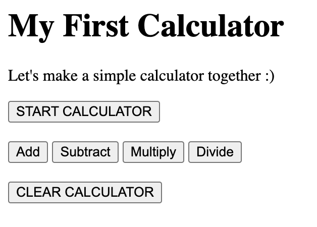

Hello! We're going to do the CFG week 5 homework together but we'll take it step-by-step so that by the end of it, you'll have created your very own simple calculator! Whoop! 

If you get really stuck, I have shared the final solution for you to refer to, but do try and create it by yourself -- you'll get more from the coding experience by learning from any errors in your code >>> Google is your best friend!

Now, let's follow the pseudocode below!

**NOTE**: You need to open your HTML in the BROWSER for the JavaScript to work. You can't use the LiveServer panel for this!

# ~ STEP 1 - Create a HTML file and a JavaScript file ~

1. Create a new folder called `week5`

2. Inside the `week5` folder, add a new JavaScript file called `calculator.js`

3. Inside the `week5` folder, add a new HTML file called `index.html`

4. Copy the below boilerplate code into your HTML file. It's good practice to place your script tag (for your JavaScript) at the bottom of your html file, rather than the top, as this means the browser will load your HTML first and then your JS, rather than the other way round.

```bash
<!DOCTYPE html>
<html lang="en">
<head>
  <title>Calculator</title>
  
</head>
<body>
  
</body>
    <script src="./calculator.js"></script>
</html>
```

# ~ STEP 2 - Create your calculator buttons ~

1. Inside the `< body >` element add the following:

- a `h1` tag saying: **My First calculator**
- a `p` tag saying: **Let's make a simple calculator together :)**
- a `button` tag saying: **START CALCULATOR**
- a `break` tag (to start a new line)
- a `button` tag saying: **Add**
- a `button` tag saying: **Subtract**
- a `button` tag saying: **Multiply**
- a `button` tag saying: **Divide**
- a `break` tag (to start a new line)
- a `button` tag saying: **CLEAR CALCULATOR**

2. For the first button **START CALCULATOR**, we're going to add an onClick command so that when the button is clicked it will run the assigned function
- 2.a. add the below INSIDE the opening button tag (so INSIDE its < > chevrons)
  - `onClick={startCalculator()}`

3. Repeat this for the other buttons, but with the following function names instead:
- `addNumber()`
- `subtractNumber()`
- `multiplyNumber()`
- `divideNumber()`
- `clearCalculator()`

4. Your HTML in the browser should look something like the image below:

 

# ~ STEP 3 - Create and declare your variables ~

1. Open your `calculator.js` file and declare 3 variables called:
- 1.a. `name` (note: assign an **empty string** to this)
- 1.b. `number` (note: no need to assign anything to this. Just end it with a semi-colon `;` )
- 1.c. `answer` (note: assign this with a `0` value)

# ~ STEP 4 - Using a do/while loop, create a function to welcome your user ~

1. Inside your `calculator.js` file, create a function called `startCalculator()`

2. Inside this function create a **do/while loop**
- 2.a. Inside the the '**do**' part of the do/while loop create a `prompt` and assign it to a variable called `name`. This prompt should ask the user "`Hello, what's your name?`"
- 2.b. Inside the '**while**' part of the **do/while loop**, using the logical NOT operator (`!`), make it so that whilst `name` is empty (i.e false/not assigned anything) the **do/while loop** will keep prompting the user for the `name` until it's received something. That completes the **do/while loop**

3. On the next line (make sure you're still coding inside your functions curly bracket) create an `alert` that welcomes the user by their `name`, and that `it's lovely to meet them`
- 3.a. Clue: can use concatenation or interpolation to achieve this output

4. This completes your first function!

# ~ STEP 5 - Using an alert, prompt, and if/else statement, create a function to add numbers together ~

1. Create a function called `addNumber()`

2. Inside this function, create an `alert` that says the `answer` with the following text of "`The calculator value is currently: `"
- 2.a. Clue: can use concatenation or interpolation to achieve this output

3. Create a `prompt` and assign it to a variable called `response`. This `prompt` should ask the user "`Clear the calculator? Enter 'y', else enter 'n'`"

4. Create an **if/else statement** that:
- 4.a. '`if`' the `(response is === "y")` what's `returned` inside these curly brackets is `(answer = 0)`
- 4.b. '`else`' if `(response is === "n")` then the following 3 things happen inside these curly brackets (each on a new line):
  - 4.b.i copy and paste this: `number = parseInt(prompt("Enter a number to add"));`
  - 4.b.ii assign the `number` variable to the `answer` variable using the `+=` operator in between them
  - 4.b.iii Create an `alert` that says the `answer` variable with the following text of "`The calculator value is now: `"
    - 4.b.iii.1 Clue: can use concatenation or interpolation to achieve this output

5. Start a new line outside of the **if/else statement** curly brackets, **BUT still inside the function curly brackets**, and `return` the `answer` variable

6. This completes your first calculator function! :D

# ~ STEP 6 - Create 3 more functions to subtract, multiply, and divide numbers too ~

1. Repeat step 4 above (can copy and paste for ease) to create the other functions: `subtractNumber()`, `multiplyNumber()`, and `divideNumber()`

2. Remember to change the function names **AND** how the number variable will be assigned to the answer variable for each of these new functions to work as intended!
- 2.a. Clue: You'll need to **change the += operator part** for each of these functions

# ~ STEP 7 - Create a function to clear the calculator value back to 0 with an alert ~

1. Create a function called `clearCalculator()`

2. Set the `answer` variable to `0` value

3. Create an `alert` that says the `answer` with the following text of "`The calculator value is now: `"
- 3.a. Clue: can use concatenation or interpolation to achieve this output

# ~ STEP 8 - Style your calculator :) ~

Whoohoo! You've now created a very simple calculator :D
Have fun styling it now with CSS.... go wild!